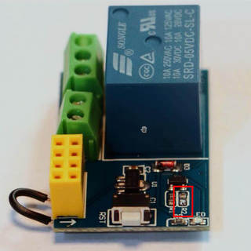

# ESP8266 Control Relay

This project is based on the Instructable
[ESP01/01S RELAY MODULE TUTORIAL](https://www.instructables.com/id/ESP0101S-RELAY-MODULE-TUTORIAL/).

I put this together to make some use of the ESP-01S relay modules I bought on
[Aliexpress](https://www.aliexpress.com/item/32962992172.html) some time ago.

There are many versions of these modules, but the ones I have (ESP-01S Relay v1.0) are actually
bugged.

In order to put them to work, I had to do a couple of things (otherwise it would refuse to run
my code).

1. [connect the EN (aka CH_EN/CH_PD) pin to the 3V3 PIN](doc/add-jumper.jpeg)


2. [get rid of resistor R2](doc/remove-r2.jpeg)



I struggled with this problem for quite some time, until I found this video:
[How to fix cheap ebay ESP8266 relay module](https://youtu.be/Uq7ZfutOSSg).

The code makes use of the
[ESP8266WiFi library](https://arduino-esp8266.readthedocs.io/en/2.7.2/esp8266wifi/readme.html)
from
[Arduino core for ESP8266 WiFi chip](https://arduino-esp8266.readthedocs.io/en/2.7.2/index.html).

## Flashing your ESP8266

Install [Arduino IDE](https://www.arduino.cc/en/main/software) and
[ESP8266 Arduino Core](https://arduino-esp8266.readthedocs.io/en/2.7.2/installing.html). At the
time I wrote this, the latest versions were 1.8.13 and 2.7.2 respectively.

Clone the project and open it on the Arduino IDE.

The code still does not make use of a WiFi Manager so you need to create a `my_network.h` file
containing the SSID/PASSWORD of the WiFi network the ESP-01S is supposed to connect. The file
should be created on the project's folder and should be like the following:

```
#define MY_SSID "<your wifi ssid>"
#define MY_PASSWORD "<your wifi password>"
```

If you are curious, I used this thing to flash my ESP-01S:
https://www.aliexpress.com/item/33011980079.html. It works like a charm. No jumpers or switches
to fiddle with.
